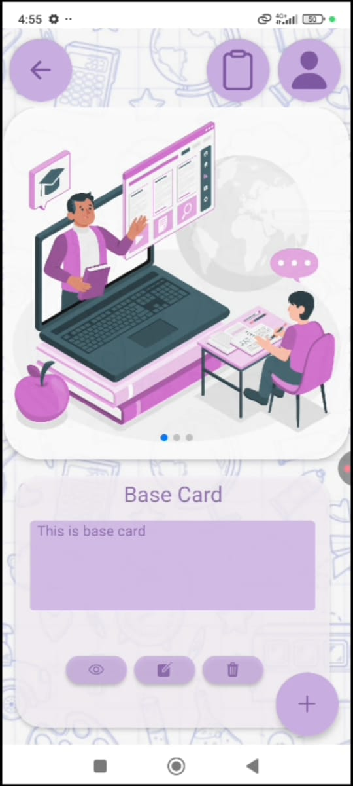
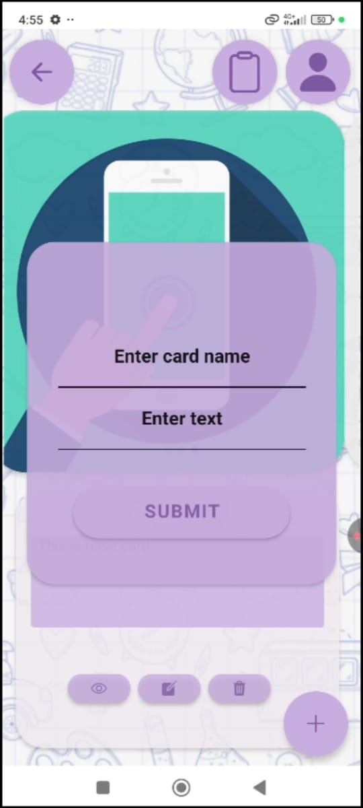

# SnapNLearn
A simple React Native app built with Expo that lets users capture, group, and organize screenshots by subject to remove the hassle of accessing them from your phones photo apps. Designed for students and learners to manage study material visually. 

## ============Under Development.Delayed due to SDK53 introduction by Expo============================

##

##

##

##

##

